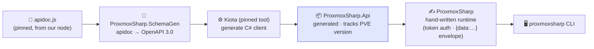

# ProxmoxSharp

[](https://www.nuget.org/packages/Chrison.ProxmoxSharp/)
[](https://www.nuget.org/packages/Chrison.ProxmoxSharp/)
[](https://github.com/Chrison-dev/ProxmoxSharp/actions/workflows/ci.yml)
[](https://github.com/Fallout-build/Fallout)
[](LICENSE)

A C# API client for Proxmox VE — **mostly code-generated from Proxmox's own
published API schema**, with a thin hand-written runtime for auth and transport.

```sh
dotnet add package Chrison.ProxmoxSharp
dotnet tool install -g Chrison.ProxmoxSharp.Cli   # the `proxmoxsharp` CLI
```

Built to be dogfooded by the [Homelab](https://github.com/Chrison-Homelab/Homelab)
hub's C#-native IaC (the Discover → Converge path). Design + roadmap live in the
hub at `docs/plans/BL-009-proxmoxsharp-codegen.md`.

## Approach



The generated client is **regenerated on build** (incrementally — only when the
schema changes) and **not committed**.

The generated client is **regenerated on build** (incrementally — only when the
schema changes) and **not committed**. Day-to-day work on the hand-written
library doesn't regenerate.

- **Read-only first** — token auth, the read path (nodes / LXC / VM / storage /
  network) before any write/lifecycle.
- **Schema is version-matched** to our cluster (PVE 9.2.2) and pinned under
  `src/ProxmoxSharp.Api/schema/`.

## Projects & versioning

| Project | What | Version |
| --- | --- | --- |
| `src/ProxmoxSharp.Api/` | The Kiota-generated client. `Generated/` is produced on build (gitignored). | **Tracks the Proxmox API release** (e.g. `9.2.2`) — breaking changes are Proxmox's. |
| `src/ProxmoxSharp/` | Hand-written runtime (`ProxmoxApi`, auth, options) over `.Api`. | **Independent SemVer** (`0.1.0`) — our surface's breaking changes drive the major. |
| `tools/ProxmoxSharp.SchemaGen/` | Converter: `apidoc.js` → OpenAPI 3.0. | — |
| `tests/ProxmoxSharp.Tests/` | Unit + (thin) read-only integration tests. | — |

The two packages move independently: bump the library for a new feature without
touching the API version; bump the API when you regenerate from a new Proxmox release.

## Build

Built with [Fallout](https://github.com/Fallout-build/Fallout) (Chris's C#/.NET
build system, a NUKE successor). Targets: `Compile` → `Test` → `Pack` → `Publish`.

```bash
./build.sh              # default: Test (Compile regenerates ProxmoxSharp.Api from the schema, then compiles)
./build.sh Pack         # produce the Chrison.* nupkgs into artifacts/
```

Requires the .NET 10 SDK (see `global.json`) and `GITHUB_PACKAGES_PAT` in the
environment (a PAT with `read:packages` on the Fallout-build org — the build restores
`Fallout.*` from that feed, see `nuget.config`). CI (`.github/workflows/ci.yml`) runs
`./build.sh Test` on push/PR — a clean checkout regenerates the client fresh.

## Use it

```csharp
var client  = ProxmoxApi.Create(options);   // token auth + base URL + TLS handling
var version = await client.Version.GetAsVersionGetResponseAsync();
var nodes   = await client.Nodes.GetAsNodesGetResponseAsync();
```

## CLI (`proxmoxsharp`)

A `dotnet` global tool (`src/ProxmoxSharp.Cli`) wrapping the library — usable from
the shell. It's self-contained (bundles the library + generated client), so install
needs only the `ProxmoxSharp.Cli` package, not its dependencies.

```bash
dotnet tool install -g Chrison.ProxmoxSharp.Cli   # from nuget.org (public)

export PROXMOX_BASE_URL="https://192.168.179.3:8006/api2/json"
export PROXMOX_TOKEN_ID="root@pam!token"
export PROXMOX_TOKEN_SECRET="…"
export PROXMOX_VERIFY_TLS=false

proxmoxsharp version     # PVE version
proxmoxsharp nodes       # list nodes
proxmoxsharp discover    # structured ClusterSnapshot as JSON
```

## Refresh the schema (new Proxmox release)

```bash
pwsh src/ProxmoxSharp.Api/schema/refresh.ps1 -Node hpe-01   # writes apidoc.<ver>.js
# then update <Version> + the schema filename in ProxmoxSharp.Api.csproj, and rebuild
```

## Dev token & secrets

Integration tests read a gitignored `secrets.env` (copy `secrets.env.example`).
Use a **dedicated read-only** token, not broad creds. The helper creates one
(privilege-separated, role `PVEAuditor` at `/`) and prints the `secrets.env` lines:

```bash
pwsh scripts/new-dev-token.ps1 -Node hpe-01
```

## Packages

Published to **nuget.org** (public) under the `Chrison.*` prefix, via **Trusted
Publishing** (OIDC — no stored API key):

| ID | Versioning |
| --- | --- |
| `Chrison.ProxmoxSharp` | independent SemVer (`0.2.0`) |
| `Chrison.ProxmoxSharp.Api` | tracks the Proxmox API release (`9.2.2`) |
| `Chrison.ProxmoxSharp.Cli` | `dotnet` tool, co-versioned with the library |

| Trigger | Versions | Workflow |
| --- | --- | --- |
| push to `main` | **prerelease** — `…-preview.<run>` | `publish.yml` |
| `v*` tag | **stable** — from `VersionPrefix` | `publish.yml` |

So every merge to `main` ships a referenceable prerelease; tagging cuts a stable
release. The library depends on the matching `.Api`. IDs use the `Chrison.*` prefix
because the bare `ProxmoxSharp` ID is taken on nuget.org by an unrelated project;
assembly names and namespaces stay `ProxmoxSharp`, so `using ProxmoxSharp;` is unchanged.

Consume from nuget.org like any public package. To track the latest prerelease, float it:
`<PackageReference Include="Chrison.ProxmoxSharp" Version="0.2.0-preview.*" />`.

## Status

M1–M5 done. Generated client reads the live cluster; `ProxmoxDiscovery` produces
a structured `ClusterSnapshot` (nodes → LXC/QEMU/storage/network); the packages
publish to nuget.org. Coverage: `/version,/nodes,/cluster,/storage,/access`
(338 GET ops). Next: the hub consumes the package; BL-014 CLI; write path (BL-010).
